# FreeCAD MetalWB Tutorial

## Create the skeleton

We are going to create a simple frame.

1. In a new file, switch to the MetalWB workbench.

2. Create a sketch, and select orientation (XY for instance)

3. Draw a simple square in the sketch... it will be our skeleton

4. Close the Sketch edit mode.

## Create the frame

1. Lauch the Warehouse Profile tool.

2. Select a profile from the list

You can change the size just below the family, the tool has a lot of predefined profile, you can also change the parameters...

3. In the 3D View, select edges to apply the profile creation:

4. And press OK in the warehouse profile window... (then, cancel to close the window !)

 

**And voila ! You have your first frame !**

## Going 3D... Making a cube !

We can build more complexe shapes, and there are severals ways of doing it.

### More Sketchs !

We can add more sketchs into our project:

1. Create a new Sketch
2. Select the same orientation as the previous one (XY)
3. Draw a square the same size and placement as the previous one.

4. Now, change the position of the sketch:

And the new sketch is 400mm on top of the first one !

You can therefore use Warehouse profile again to create another square frame !

### Parametric Line

You can create parametrics lines for joining two vertexes (points), theses lines can be used with Warehouse Profile as well...

1. one can hide profiles objects with [Space Bar] (it allows to see the sketches)

2. Selects vertexes

3. Create Parametric Line

You can therefore use Warehouse profile again to create another square frame !

4. Open Warehouse Profile, select the profile you want
5. Select the Parametric line, click OK then Cancel..

### More Sketchs / Part2 !

There is another ways to add sketchs, that allows to do more complicated stuff...

Sometime you want add a sketch to a specific place, and link it to another sketch. (If you modify the first Sketch, then the second will follow, hopefully)

This is not possible with the Position / Base Placement, that is an absolute position.

We are going to "Map" the sketch to something else.

1. Create a new Sketch, and set orientation to: YZ

I added a circle so you can see where it is..

2. Click on the map mode property:

You can change the map mode, selecting faces, vertexes and edges...

Here, our circle is in a new plan, the one at the top left of the screen...

There are a lot of options here. You can then edit the sketch, and create more line and frames...

## Bevels and corners.

As you can see, the junctions are not that good (yet !). The profiles are centered on the skeleton, and stops right at the end of the edges.

We are going to make corners, and bevels. There are two methods for that.

### Via Bevels property

It is my favorite for simple frame..

Let's hide everything except the first frame we made...

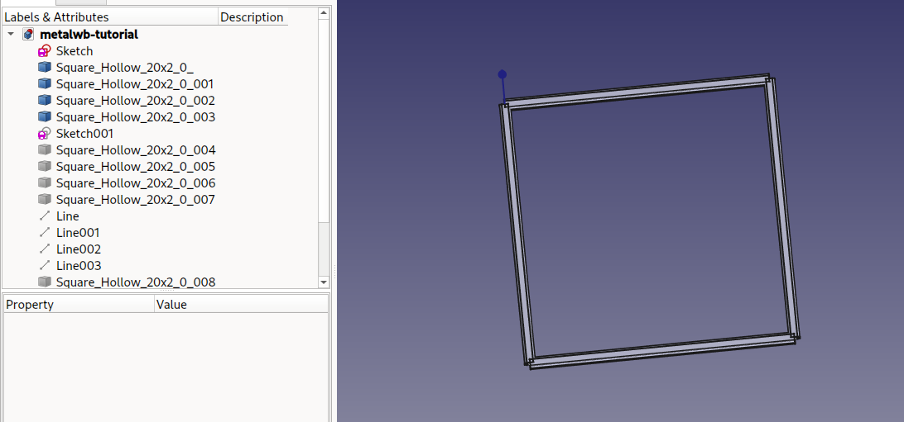

1. Select one of the profile, and in the property section, go for Bevel Start/End Cut 1/2

There are 4 entries (Start / End Cut1 Cut2)

That allows you to create bevels in the two axis, at the start or end of the profile.

Negative angles works, and must be used to compensate directions.

You can batch-modify that, by selecting all the profiles....

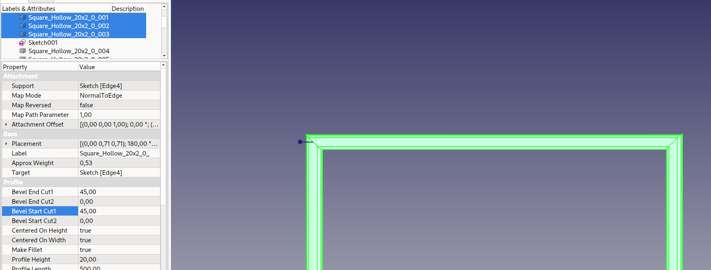

And Voila ! a square frame !

### Via Corners function

Let's show the other base frame ...

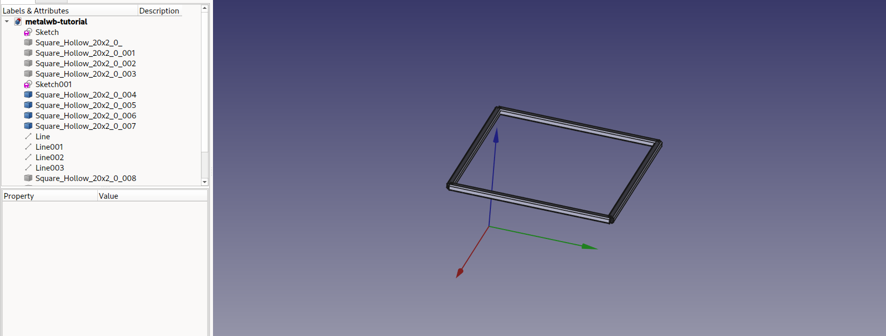

This method take longer, but allows for more complexs forms...

We first must add offsets to the existing profiles...  (offsets are cool because it adds up to the dimension of the sketch !)

1. add Offset (batch or single...)

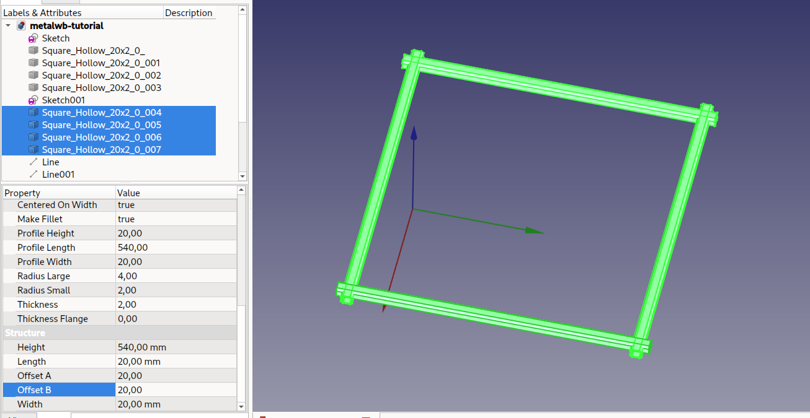

2. Unselect all objects, and click on create corner

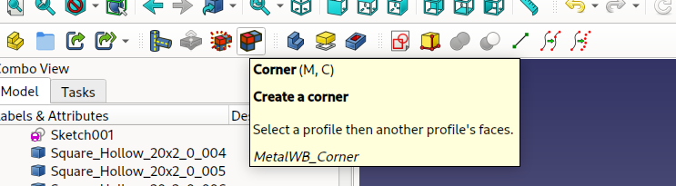

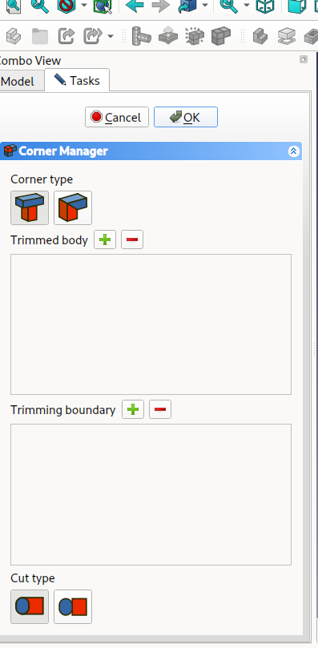

Select the end miter option

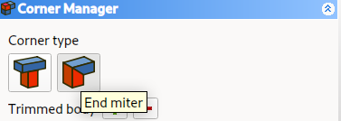

3. In the 3D view, select the object (profile you want to cut)

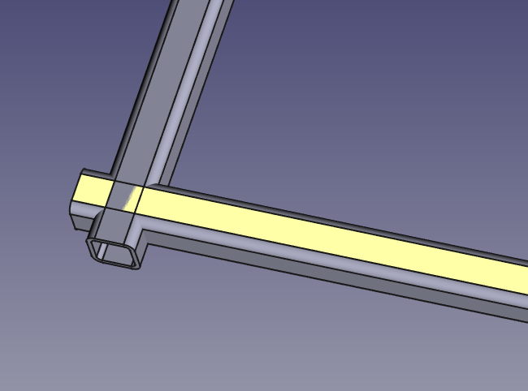

and click on the "Trimmed Body" "+" sign. It will add the profile to the body trimmed

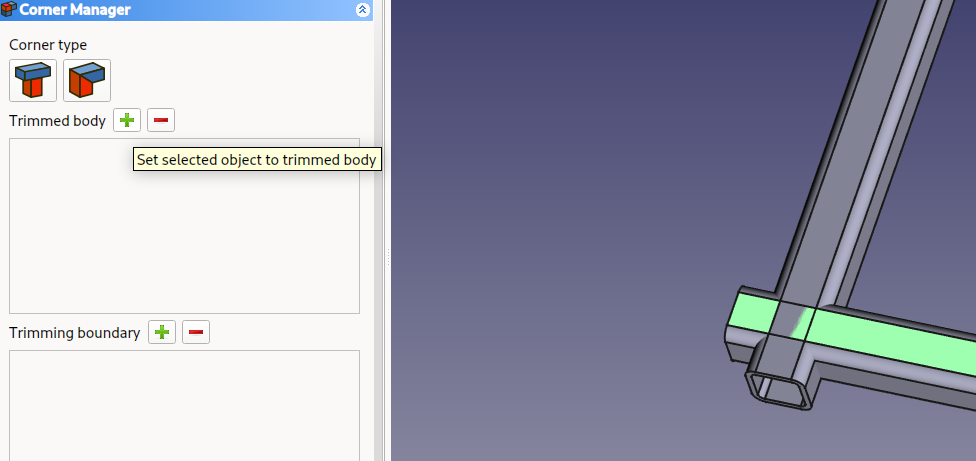

The profile will hide, helping you selecting the trimming boundary.

4. select the face of the profile you want to trim with the first profile, and add to trimming boundary into the corner manager.

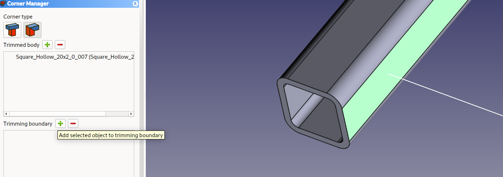

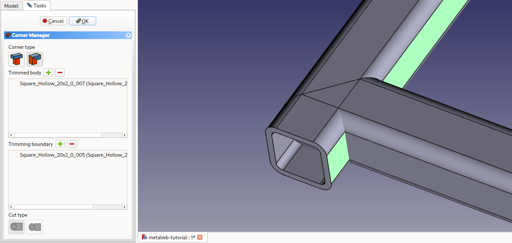

5. Press ok to validate.

Now, you have one of the profile that has a nice miter joint.

You have to do it again, swapping trimmed body and boundary to maake the other profile

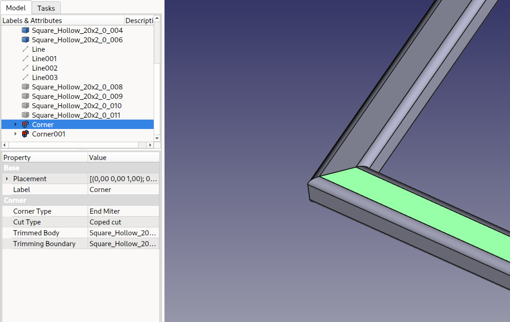

Notice the Corner objects ! They are build from "Square objects" from MetalWB.

### More complex Corners

Let's finish the 3 others corners of the second frame...

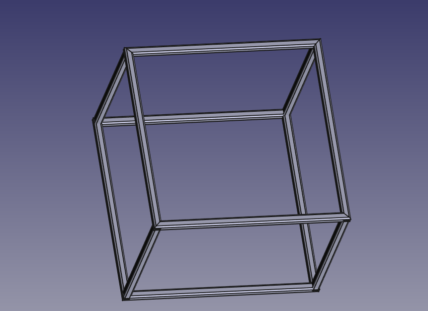

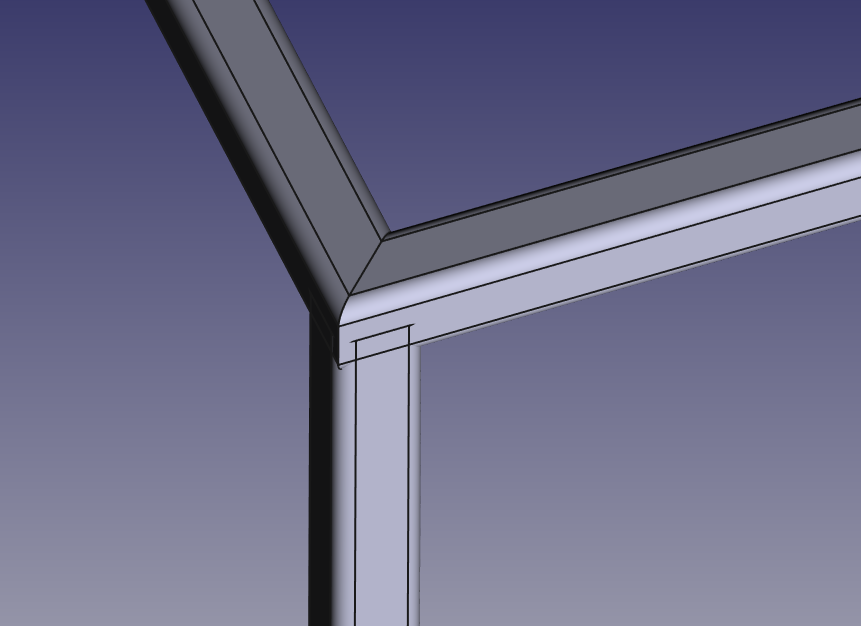

When everything is showed again, you can see the vertical profiles are not cut as they should...

Let's open again the corner manager, selecting "end trim"

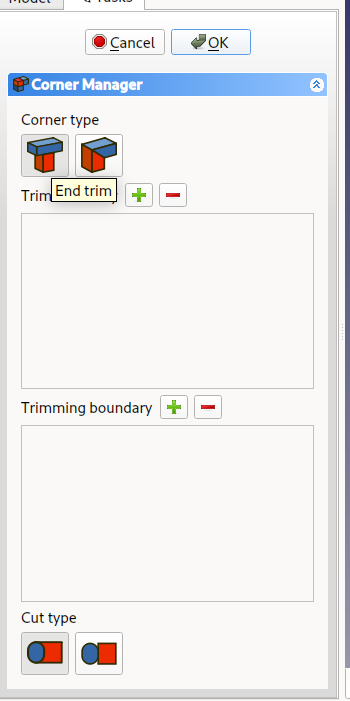

1. Select the vertical profile first, add it to the trimmed body with the plus button,
2. Select the face of the profile you want to cut with.. (here, I add to move the view and select the bottom **face**)

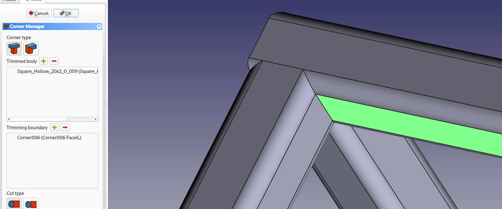

You can change the cut type: straight or following the other profile.

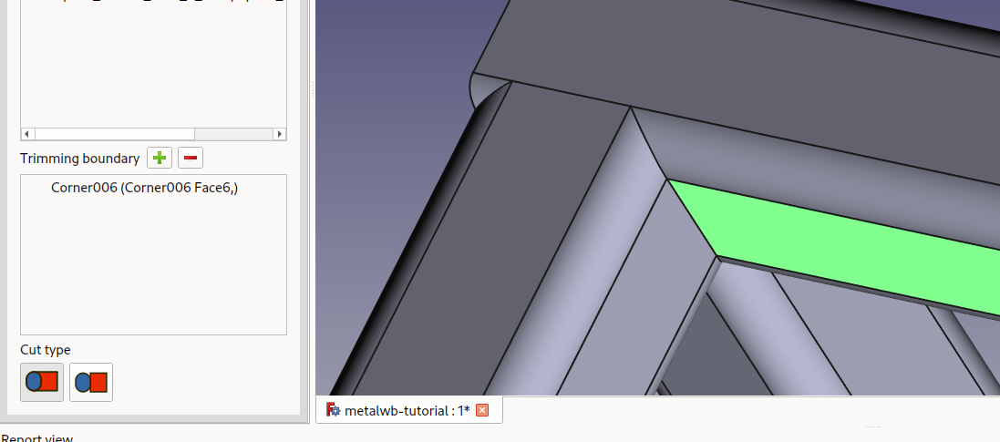

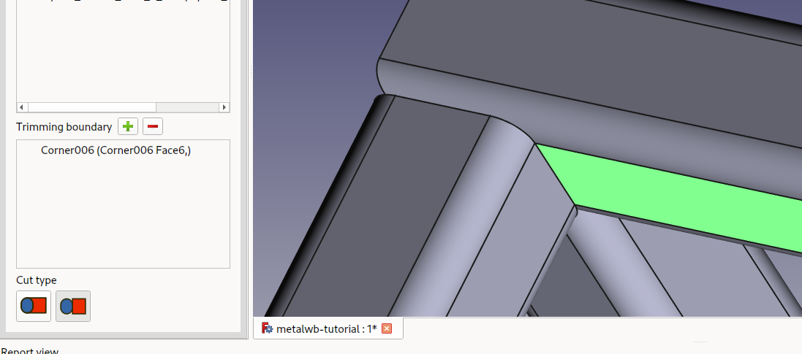

## Organizing Objects

That's the bad part.

I find the tree view messy. Really messy.

### Part Container

I often use Part container for grouping profiles, sketchs, etc.

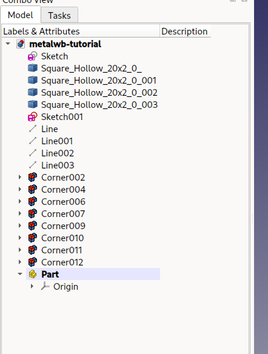

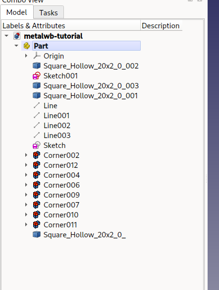

You need to drag only one profile to the container... I don't know why, but FreeCAD is not happy about a group drag.

Sometime parts and profile get out of the Part Container.

### Fusion

One can fuse profiles together.

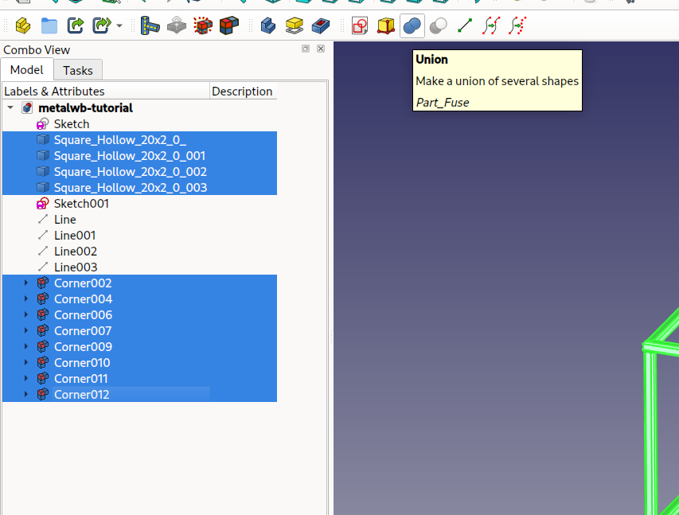

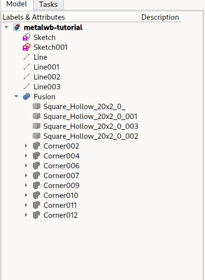

It allows to group objects. 

## Using profiles in Part Design... ie, making holes !

To use all of theses profiles in PartDesign, for instance, to make holes... in it.. !

you need to use a fusion of the profile, and create a body...

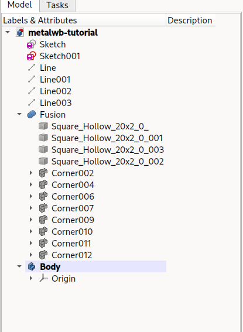

1. Drag and drop the fusion into the body.

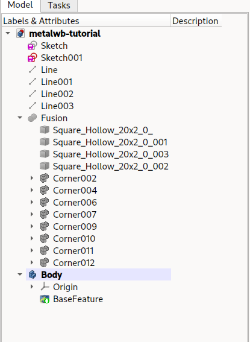

2. Now, you have a standard Part design Body...

You can map a sketch to any face, and use Part design to do whatever you want !

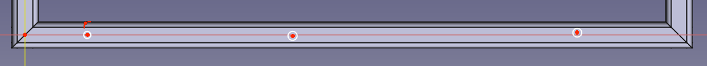

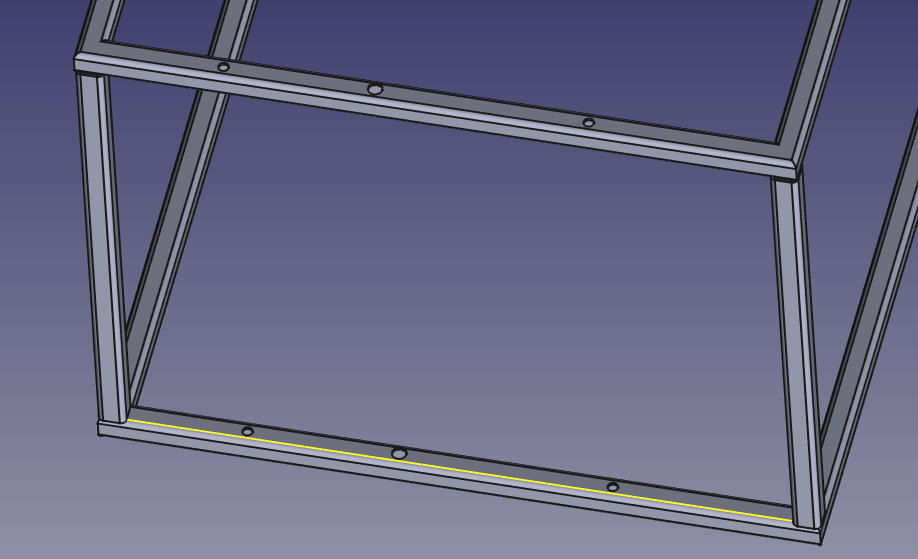