# FreeCAD MetalWB Tutorial

## Create the skeleton

We are going to create a simple frame.

1. In a new file, switch to the MetalWB workbench.

2. Create a sketch, and select orientation (XY for instance)

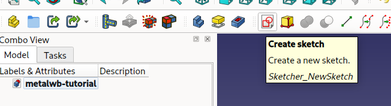

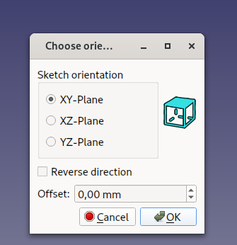

3. Draw a simple square in the sketch... it will be our skeleton

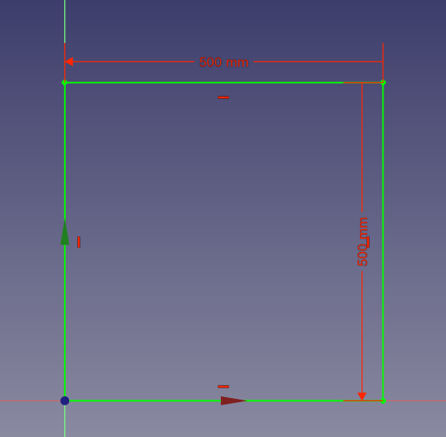

4. Close the Sketch edit mode.

## Create the frame

1. Lauch the Warehouse Profile tool.

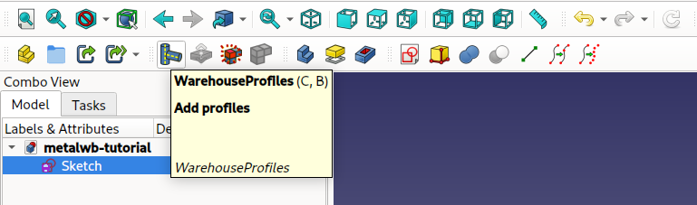

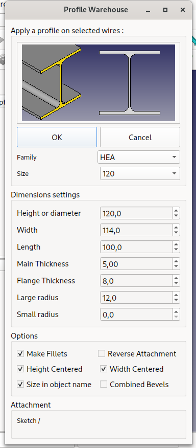

2. Select a profile from the list

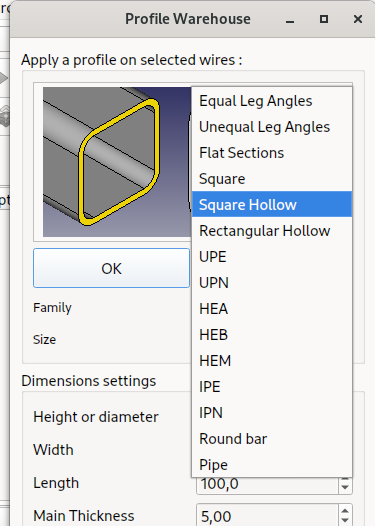

You can change the size just below the family, the tool has a lot of predefined profile, you can also change the parameters...

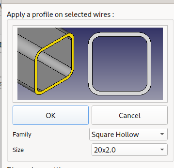

3. In the 3D View, select edges to apply the profile creation:

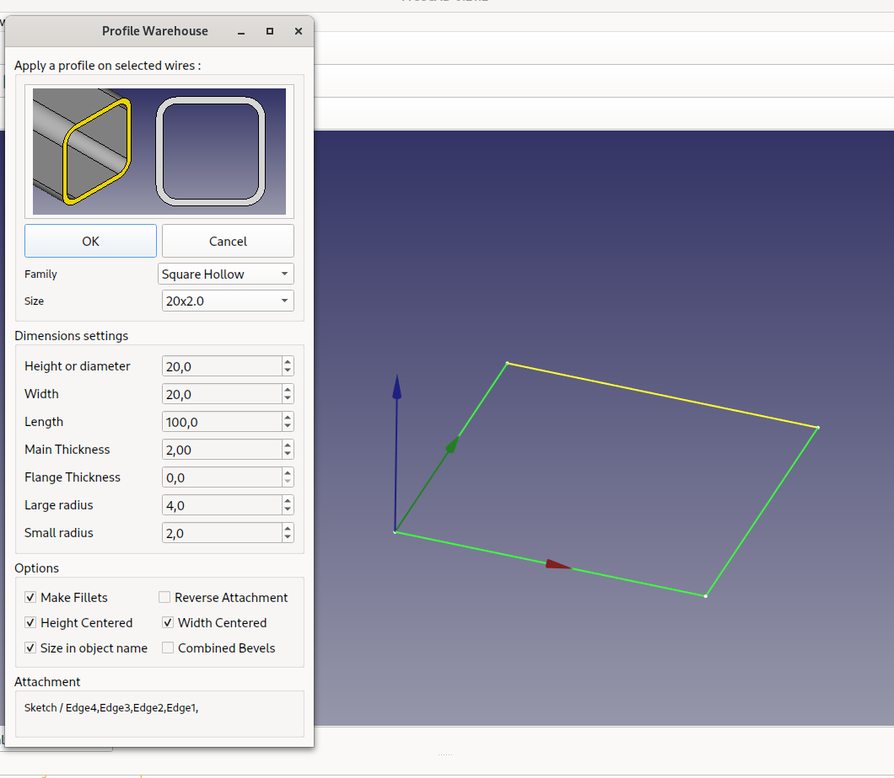

4. And press OK in the warehouse profile window... (then, cancel to close the window !)

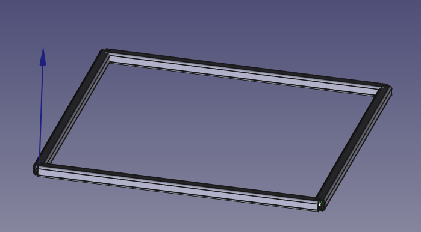
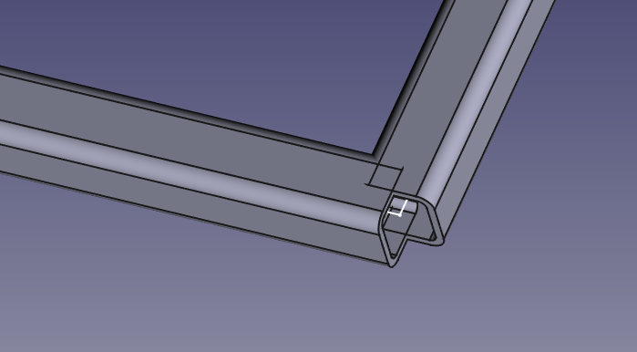

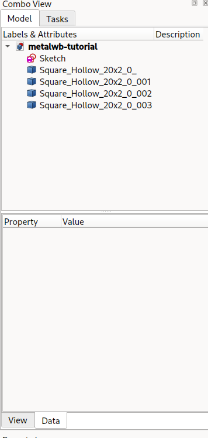 

**And voila ! You have your first frame !**

## Going 3D... Making a cube !

We can build more complexe shapes, and there are severals ways of doing it.

### More Sketchs !

We can add more sketchs into our project:

1. Create a new Sketch
2. Select the same orientation as the previous one (XY)
3. Draw a square the same size and placement as the previous one.

4. Now, change the position of the sketch:
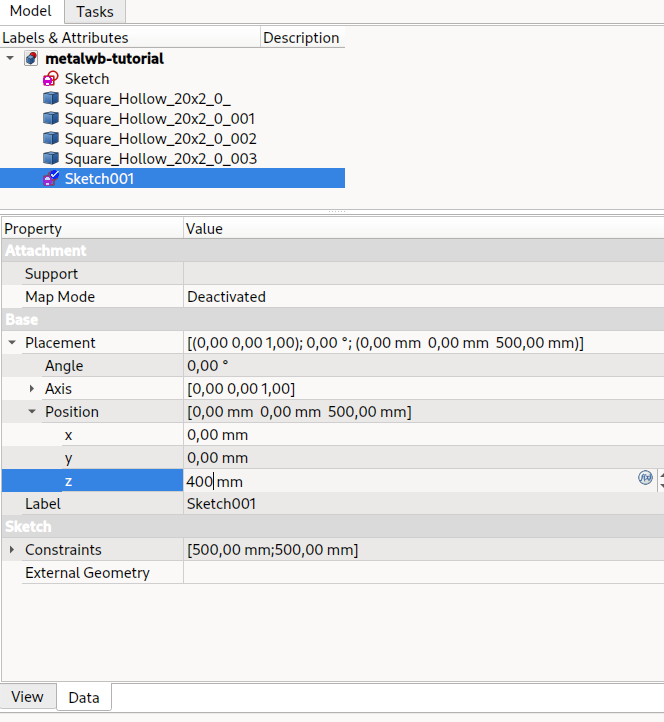

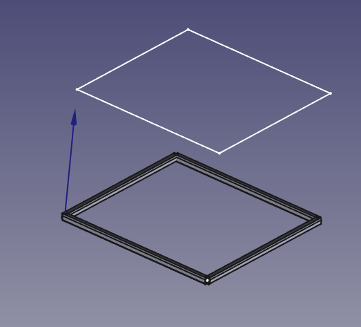

And the new sketch is 400mm on top of the first one !

You can therefore use Warehouse profile again to create another square frame !

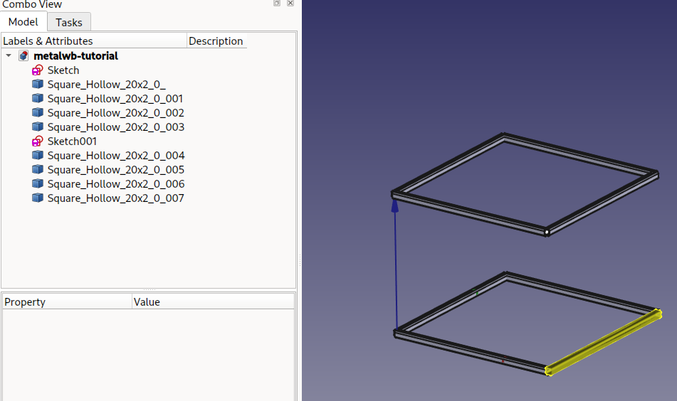

### Parametric Line

You can create parametrics lines for joining two vertexes (points), theses lines can be used with Warehouse Profile as well...

1. one can hide profiles objects with [Space Bar] (it allows to see the sketches)

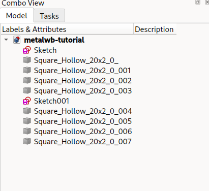

2. Selects vertexes

3. Create Parametric Line

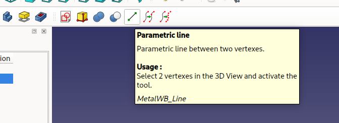
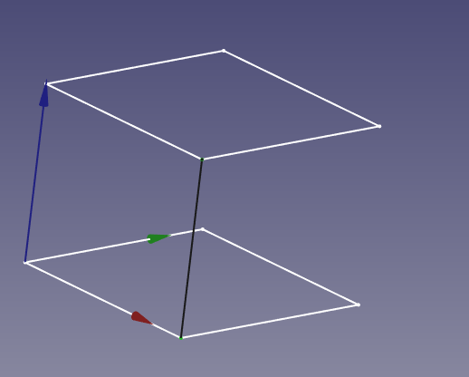

You can therefore use Warehouse profile again to create another square frame !

4. Open Warehouse Profile, select the profile you want
5. Select the Parametric line, click OK then Cancel..

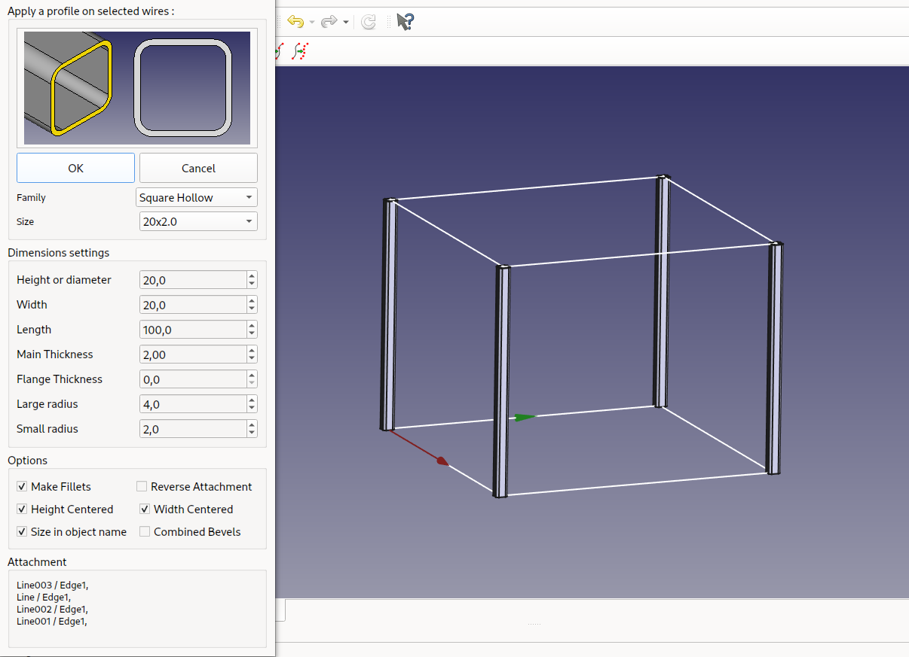

### More Sketchs / Part2 !

There is another ways to add sketchs, that allows to do more complicated stuff...

Sometime you want add a sketch to a specific place, and link it to another sketch. (If you modify the first Sketch, then the second will follow, hopefully)

This is not possible with the Position / Base Placement, that is an absolute position.

We are going to "Map" the sketch to something else.

1. Create a new Sketch, and set orientation to: YZ

I added a circle so you can see where it is..
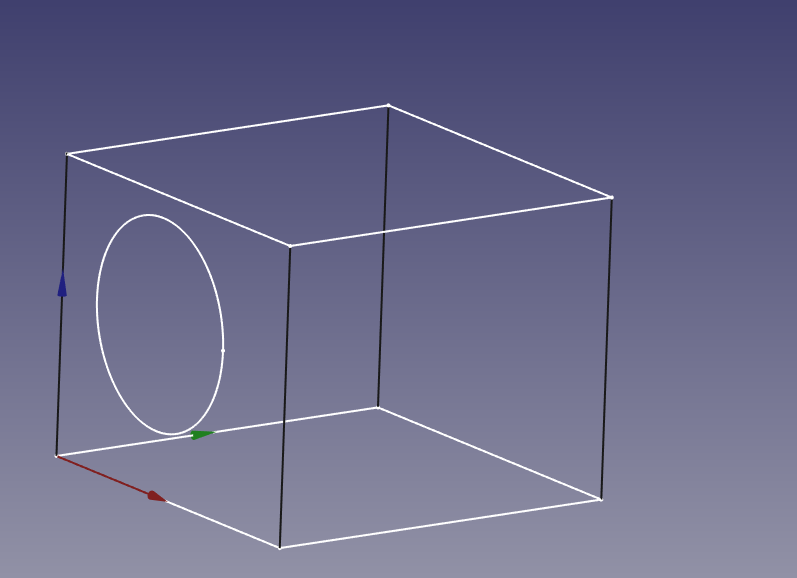

2. Click on the map mode property:

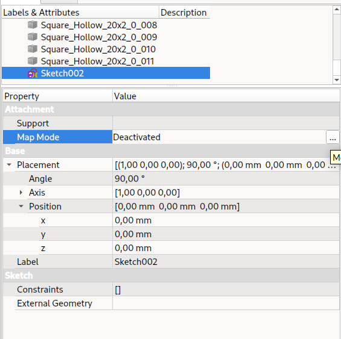

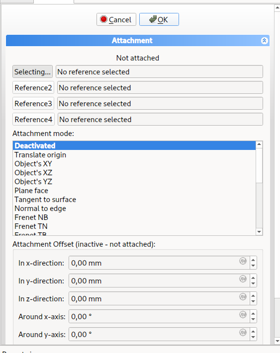

You can change the map mode, selecting faces, vertexes and edges...

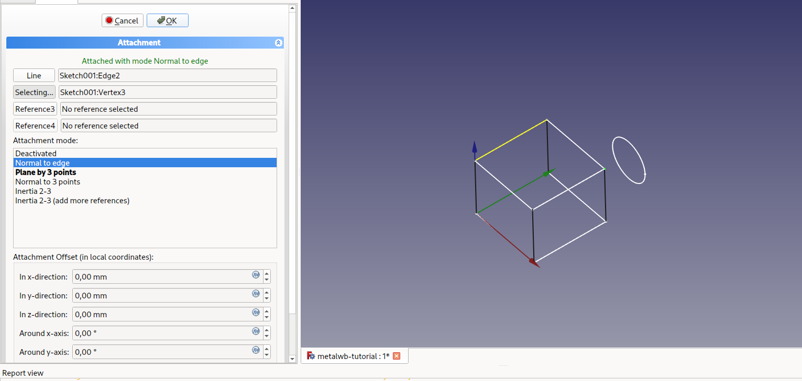

Here, our circle is in a new plan, the one at the top left of the screen...

There are a lot of options here. You can then edit the sketch, and create more line and frames...

## Bevels and corners.

As you can see, the junctions are not that good (yet !). The profiles are centered on the skeleton, and stops right at the end of the edges.

We are going to make corners, and bevels. There are two methods for that.
